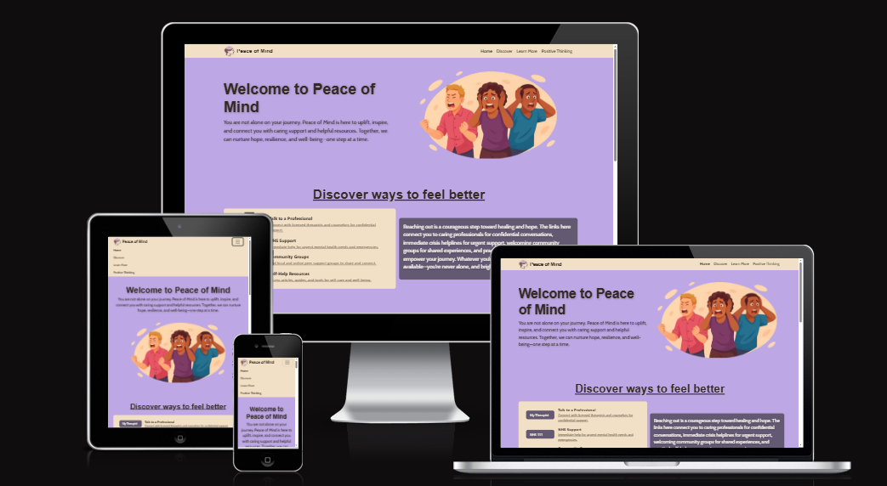

# Peace of Mind

Discover a calming, beginner-friendly resource dedicated to mental health awareness. This website offers clear explanations, supportive guidance, and practical tools to help you understand common mental health topics, manage stress, and find helpful resources—all in a soothing, accessible environment.

---

## Goal

The goal of this website is to provide **accessible, beginner-friendly information on mental health**. It aims to help users recognize common mental health issues and manage stress, all presented in a supportive and organized layout.

---

## AI-Assisted User Story Generation

To streamline the planning process, I used **ChatGPT** to generate several user stories. After reviewing and refining these stories to fit the project scope, I also used ChatGPT to generate acceptance criteria and tasks for each story. This approach significantly reduced the time required to develop user stories, criteria, and tasks.

All user stories were added to the GitHub project board and organized using **"must have," "should have," and "could have"** labels for clarity and prioritization.

---

## AI Palette Verification

I used ChatGPT to check if the color palette I created for the design of the page fit a calm and relaxing feel that is user friendly. This was the outcome of that question:

> **Here's a quick breakdown of the colors from your Coolors link:**
>
> -   `#F1E0C5` – a warm, creamy beige
> -   `#C9B79C` – a soft, muted taupe
> -   `#7B6D8D` – a dusty lavender/gray-purple
> -   `#342A21` – a deep, earthy brown
> -   `#BEA7E5` – a gentle, pastel lilac
>
> **Does it invoke a calm feel?**
>
> Yes, it does. Here's why:
>
> -   **Muted tones:** None of the colors are overly saturated, which contributes to a sense of tranquility and softness.
> -   **Warm neutrals** (`#F1E0C5`, `#C9B79C`, `#342A21`): These earthy tones ground the palette and evoke comfort and calm.
> -   **Soft purples** (`#7B6D8D`, `#BEA7E5`): Purples, especially in dusty or pastel tones, tend to feel introspective, serene, and slightly dreamy.
>
> **Overall Vibe:**  
> This palette feels like a quiet moment at dusk—warm light fading into cool shadows. It could easily be used for themes of reflection, gentle fantasy, nostalgia, or cozy minimalism.

---
## Additional Areas Where GitHub Copilot Assisted

GitHub Copilot played a significant role throughout the development of this project, providing valuable assistance in several key areas:

### 1. Code Generation and Suggestions

- **HTML & CSS:** Copilot suggested boilerplate code, semantic HTML structures, and responsive CSS classes, accelerating the initial setup and layout design.
- **Bootstrap Integration:** It provided code snippets for Bootstrap components, such as navigation bars, carousels, and modals, ensuring consistent and accessible UI elements.
- **JavaScript Enhancements:** Copilot recommended concise JavaScript solutions for UI interactions, including the dropdown menu auto-close fix and smooth scrolling features.

### 2. Accessibility Improvements

- **ARIA Attributes:** Copilot suggested appropriate ARIA roles and attributes to enhance accessibility for users with assistive technologies.
- **Keyboard Navigation:** It provided code patterns to ensure all interactive elements are accessible via keyboard.

### 3. Image Generation Guidance

- **Image Prompts:** Copilot assisted in crafting prompts for AI-powered image generation, ensuring visuals matched the site’s calming and supportive theme.
- **Image Integration:** It suggested best practices for optimizing and embedding images within the site for performance and accessibility.

### 4. Content Structuring

- **Markdown Formatting:** Copilot helped organize documentation sections, generate tables of contents, and maintain consistent markdown formatting.
- **Wireframe Documentation:** It provided templates for presenting wireframes and design iterations clearly within the README.

### 5. Validation and Best Practices

- **Code Validation:** Copilot recommended tools and methods for validating HTML and CSS, such as the W3C Markup Validation Service.
- **Best Practices:** It suggested improvements for code readability, maintainability, and adherence to web standards.

### 6. Resource Linking

- **Helpful Links:** Copilot assisted in curating and formatting links to reputable mental health resources and organizations.

---

By leveraging GitHub Copilot’s AI-powered suggestions and code generation, the project benefited from increased development speed, improved code quality, and enhanced accessibility, resulting in a more robust and user-friendly application.

---

## Image Creation and Integration

To maintain a cohesive and calming visual theme, I used GitHub Copilot’s AI-powered image generation to create a set of custom images for the website. This ensured that all visuals consistently reflect the site’s purpose—promoting mental health awareness in a supportive and soothing manner.

Each image was designed to complement the chosen color palette, emphasizing soft, tranquil tones that align with the overall aesthetic. This approach helps unify the site’s imagery, layout, and colors, resulting in a harmonious and inviting user experience. The custom images not only enhance visual appeal but also reinforce the site’s message of calm, clarity, and encouragement.

### Custom Images Created

-   
-   
-   
-   
-   
-   

Additionally, each carousel background was custom-generated to match the site’s theme, such as:

-   

---

### Wireframes

Based on the user stories generated with ChatGPT, I designed wireframes for the site, starting with a **mobile-friendly layout**:

Afterwards, I quickly created a **desktop (web) version** of the wireframe:

As the development progressed, some design elements evolved beyond the initial wireframes. To ensure the wireframes accurately reflected the updated look and feel of the site, I revised them to match the emerging design direction. Below are the updated wireframes, which incorporate these adjustments:

---

## Deployment

To deploy this website using **GitHub Pages**, follow these steps:

1. **Open your repository on GitHub.**
2. Click on the **Settings** tab at the top of the repository page.
3. In the sidebar, select **Pages**.
4. Under **"Branch"**, choose `main` as the source branch and set the folder to `/ (root)` or `/docs` (depending on where your `index.html` is located).
5. Click **Save**.
6. Wait a few moments for GitHub Pages to build and deploy your site.
    - A link to your live website will appear at the top of the Pages settings once deployment is complete.

---

---

## Application’s Purpose

The purpose of this application is to raise awareness about mental health by providing clear, accessible, and supportive information for users of all backgrounds. It is designed to:

-   **Educate:** Offer beginner-friendly explanations of common mental health conditions, symptoms, and coping strategies.
-   **Support:** Create a welcoming environment where users can learn about mental health without stigma or judgment.
-   **Empower:** Help users recognize signs of mental health challenges and encourage proactive self-care.
-   **Guide:** Direct users to reputable resources, organizations, and professional support services.
-   **Promote Well-being:** Present information in a calming, organized layout that reduces stress and encourages reflection.

By combining thoughtful design, reliable information, and helpful resources, the application aims to make mental health knowledge approachable and actionable for everyone.

---

## User Value

This website delivers significant value to its users by focusing on accessibility, clarity, and support in the context of mental health. Key user benefits include:

-   **Accessible Information:** Users of all backgrounds and experience levels can easily find and understand essential mental health topics, symptoms, and coping strategies.
-   **Supportive Environment:** The site’s calming design and non-judgmental tone foster a sense of safety, encouraging users to explore mental health topics without stigma.
-   **Empowerment:** By providing clear explanations and practical resources, users are empowered to recognize signs of mental health challenges and take proactive steps toward self-care.
-   **Guidance to Resources:** Direct links to reputable organizations and professional services help users quickly access further support when needed.
-   **Inclusive Design:** Mobile-first, responsive layouts and accessible color palettes ensure a comfortable experience for all users, regardless of device or ability.
-   **Encouragement for Reflection:** Interactive features and gentle feedback promote self-awareness and reflection, supporting users on their mental health journey.

Overall, the website aims to make mental health knowledge approachable, actionable, and supportive, helping users feel informed, understood, and encouraged.

---

## Code Validation

After completing the minimum viable product, I used the [W3C Markup Validation Service](https://validator.w3.org/) to check the HTML code for errors. The initial validation revealed several issues, as shown below:

I promptly addressed these errors and revalidated the code. The updated validation confirmed that all issues had been resolved:

## CSS Validation

After ensuring the HTML was error-free, I also validated the site’s CSS using the [W3C CSS Validation Service](https://jigsaw.w3.org/css-validator/). The results confirmed that the stylesheet passed without any errors or warnings:

This validation helps guarantee that the site’s styles are standards-compliant and should render consistently across modern browsers.

## Lighthouse Performance Audit

After compressing all images in the project to optimize loading times, I used Google Chrome DevTools to run a **Lighthouse audit** on the deployed site. Lighthouse evaluates key aspects such as performance, accessibility, best practices, and SEO. Below is the resulting score:

This high score demonstrates that the site is well-optimized, accessible, and follows web development best practices.
---

## Features

-   **Beginner-friendly information:** Clear, accessible explanations of mental health topics and common conditions.
-   **Calming, accessible design:** Soothing color palette and thoughtful layout to promote comfort and ease of use.
-   **Mobile-first, responsive layout:** Optimized for seamless viewing on all devices.
-   **Custom AI-generated images:** Unique visuals created to match the site’s calming theme.
-   **AI-powered planning:** User stories, acceptance criteria, and tasks generated and refined with AI for focused development.
-   **Intuitive navigation:** Well-organized content structure for easy browsing.
-   **Quick start:** No build steps required—simply open `index.html` to begin.
-   **Helpful resource links:** Direct access to reputable mental health organizations and support services.
-   **Evolving wireframes:** Regularly updated design mockups reflecting ongoing improvements.
-   **Open-source:** Welcoming contributions from the community.

---

## Technologies Used

-   **HTML5 & CSS3** – for structure and styling
-   **Bootstrap 5** – for responsive layout and UI components
-   **AI tools:**
    -   ChatGPT – for user stories, acceptance criteria, and palette verification
    -   GitHub Copilot – for generating custom images and code suggestions
-   **Coolors** – for color palette creation and management

---

## Known Issues

-   On mobile and tablet devices, after selecting an item from the dropdown menu, the menu does not automatically close. This causes it to remain open and cover the section title, resulting in a UI issue.

    ### Solution

    To address this issue, I consulted GitHub Copilot for suggestions and confirmed that the problem could be resolved with a small JavaScript snippet. By adding this script, the dropdown menu now automatically closes after a selection is made, resulting in a smoother and more user-friendly experience.

## Roadmap

### Planned Improvements

-   **Add more mental health topics:**  
     Expand the site’s content to cover additional mental health conditions and topics, such as eating disorders, bipolar disorder, OCD, and coping strategies for various life situations. This will provide users with a broader range of information and support.

-   **Expand resource links:**  
     Curate and include more links to reputable mental health organizations, hotlines, and online resources. This will help users find further support, self-help tools, and professional assistance relevant to their needs.

-   **Add language/localization support:**  
     Implement multilingual options so users can access the site in different languages. This will make the information more accessible to a diverse, global audience.

-   **Add a self-check form page:**  
     Create an interactive self-assessment form to help users reflect on their mental health and recognize potential concerns. The form will provide gentle feedback.

-   **Add a gentle relaxing music player:**  
     Integrate a built-in music player featuring calming, royalty-free tracks. This feature aims to enhance the site’s soothing atmosphere and offer users a way to relax while browsing.

---

## Credits

-   [Jacob Smith] (https://github.com/JakeSoGreat)
-   AI tools: ChatGPT, GitHub Copilot
-   Livewell Southwest: https://www.livewellsouthwest.co.uk/inpatient-mental-health-neurology/first-response-24-7-helpline
-   My Therapist: https://www.mytherapistonline.co.uk/
-   NHS 111: https://111.nhs.uk/guided-entry/mental-health-help
-   Devon Mind: https://www.devonmind.com/find-help/groups
-   Mental Health Foundation: https://www.mentalhealth.org.uk/explore-mental-health/articles
-   Nation Library of Medicine: https://www.ncbi.nlm.nih.gov/books/NBK470361/, https://www.nimh.nih.gov/health/topics/depression, https://www.ncbi.nlm.nih.gov/books/NBK559129/, https://www.ncbi.nlm.nih.gov/books/NBK585058/
