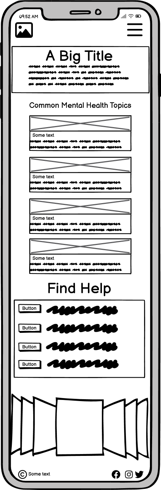
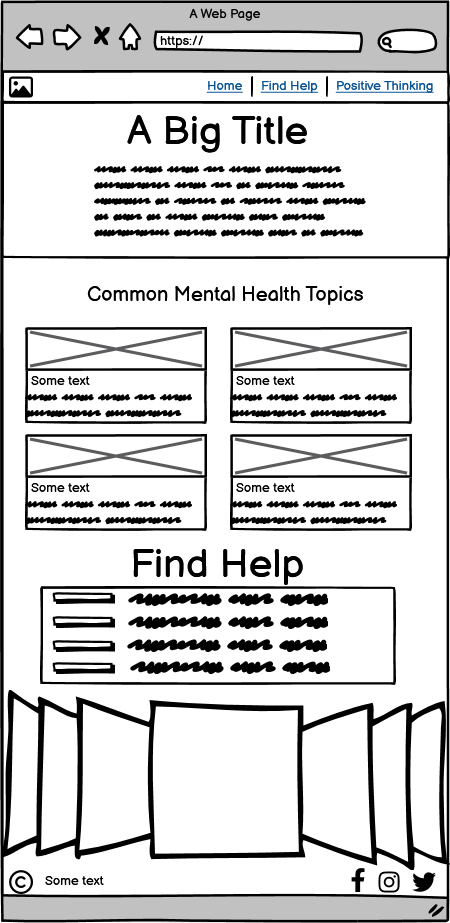

# Mental Health Awareness

## Goal

The goal of this website is to provide **accessible, beginner-friendly information on mental health**. It aims to help users recognize common mental health issues and manage stress, all presented in a supportive and organized layout.

---

## AI-Assisted User Story Generation

To streamline the planning process, I used **ChatGPT** to generate several user stories. After reviewing and refining these stories to fit the project scope, I also used ChatGPT to generate acceptance criteria and tasks for each story. This approach significantly reduced the time required to develop user stories, criteria, and tasks.

All user stories were added to the GitHub project board and organized using **"must have," "should have," and "could have"** labels for clarity and prioritization.

---

## AI Palette Verification

I used ChatGPT to check if the color palette I created for the design of the page fit a calm and relaxing feel that is user friendly. This was the outcome of that question:

> **Here's a quick breakdown of the colors from your Coolors link:**
>
> - `#F1E0C5` – a warm, creamy beige  
> - `#C9B79C` – a soft, muted taupe  
> - `#7B6D8D` – a dusty lavender/gray-purple  
> - `#342A21` – a deep, earthy brown  
> - `#BEA7E5` – a gentle, pastel lilac
>
> **Does it invoke a calm feel?**
>
> Yes, it does. Here's why:
>
> - **Muted tones:** None of the colors are overly saturated, which contributes to a sense of tranquility and softness.
> - **Warm neutrals** (`#F1E0C5`, `#C9B79C`, `#342A21`): These earthy tones ground the palette and evoke comfort and calm.
> - **Soft purples** (`#7B6D8D`, `#BEA7E5`): Purples, especially in dusty or pastel tones, tend to feel introspective, serene, and slightly dreamy.
>
> **Overall Vibe:**  
> This palette feels like a quiet moment at dusk—warm light fading into cool shadows. It could easily be used for themes of reflection, gentle fantasy, nostalgia, or cozy minimalism.

---

## Image Creation and Integration

To maintain a cohesive and calming visual theme throughout the website, I used Copilot’s AI-powered image generation tool to create a series of custom images. This approach ensured that all visuals aligned with the overall mood and purpose of the site—promoting mental health awareness in a supportive and soothing way.

By leveraging this tool, I tailored each image to match the site's chosen color palette, focusing on soft, calming tones. This created a streamlined visual experience where imagery, layout, and color scheme work together harmoniously. These custom images enhance the site's aesthetic appeal and reinforce the message of calm, clarity, and encouragement.

---
### Wireframes

Based on the user stories generated with ChatGPT, I designed wireframes for the site, starting with a **mobile-friendly layout**:

Afterwards, I quickly created a **desktop (web) version** of the wireframe:

---

## Getting Started

1. Clone the repository:
2. Open `index.html` in your browser.

No build steps required—just open the file!

---

## Features

- Beginner-friendly mental health information
- Calming, accessible design
- Mobile-first responsive layout
- Custom AI-generated images and color palette

---

## Technologies Used

- HTML5 & CSS3
- Bootstrap 5
- AI tools: ChatGPT (user stories, palette), Copilot (images)

---

## Credits

- [Jacob Smith] (https://github.com/JakeSoGreat)
- AI tools: ChatGPT, GitHub Copilot

